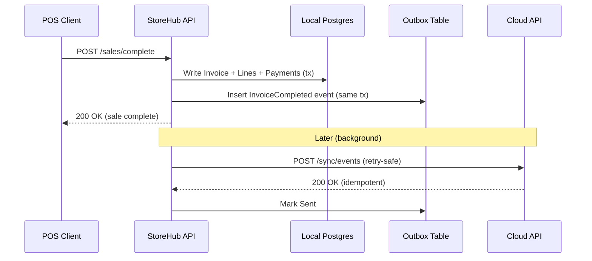

# Architecture Overview (Offline-First)

Version: 1.1.0  
Updated: 2026-02-28

## System shape

**POS Clients (desktop + tablet)**  
→ **StoreHub API (ASP.NET Core)**  
→ **Local PostgreSQL (localhost only)**  
→ **Outbox + Sync Worker**  
→ **Cloud API (Singapore)**  
→ **Central PostgreSQL**

## Key rules

- Checkout must succeed even with no internet.
- Terminals never connect to Postgres directly; they call StoreHub API.
- Cloud ingestion is idempotent (safe retries).
- Transactions use `PublicId` (GUID) + `StoreId` as stable identifiers.

## Example: high-level flow (invoice completion)



## Example: configuration keys

```json
{
  "Store": {
    "Id": "STORE-001",
    "Name": "Bangkok Branch 1"
  },
  "ConnectionStrings": {
    "StoreHubDb": "Host=127.0.0.1;Port=5432;Database=indypos_storehub;Username=indypos_app;Password=***"
  },
  "Cloud": {
    "BaseUrl": "https://api.indypos.example",
    "ApiKey": "STORE-001:***"
  }
}
```
