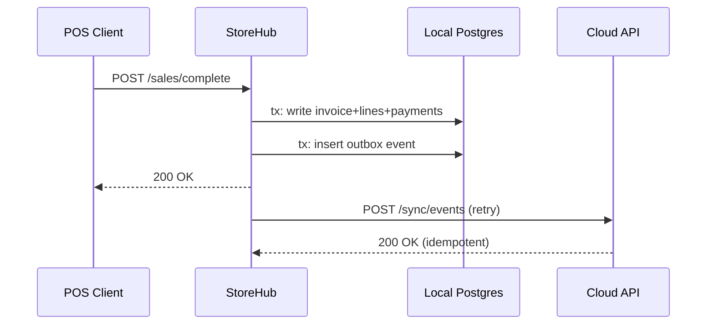

# IndyPOS – Offline-First Architecture & Operations (with implementation examples)

Version: 1.1.0  
Updated: 2026-02-28

This document is the “single page” summary. For deeper detail, see the `/docs` package.

---

## 1) Architecture overview (example)

**POS Clients** → **StoreHub API** → **Local Postgres** → **Outbox** → **Cloud API** → **Central Postgres**

Example (Mermaid):



---

## 2) Local PostgreSQL production handling (example)

- PostgreSQL runs as Windows Service
- `listen_addresses = '127.0.0.1'`
- backups every 4 hours using `pg_dump`

Example backup command:

```powershell
$env:PGPASSWORD="***"
& "C:\Program Files\PostgreSQL\16\bin\pg_dump.exe" -h 127.0.0.1 -p 5432 -U indypos_app -F c -Z 6 -f "C:\ProgramData\IndyPOS\backups\indypos_storehub.dump" indypos_storehub
```

---

## 3) PostgreSQL schema based on existing SQLite tables (example)

Backward compatible identifiers:
- keep `Id` int/bigint internally
- add `PublicId` UUID UNIQUE NOT NULL for sync/API

Example table:

```sql
CREATE TABLE invoice (
  id bigserial PRIMARY KEY,
  public_id uuid NOT NULL UNIQUE,
  store_id varchar(50) NOT NULL,
  total_amount numeric(18,2) NOT NULL,
  created_utc timestamptz NOT NULL,
  last_modified_utc timestamptz NOT NULL
);
```

---

## 4) Use EF Core instead of Dapper (example)

Example DbContext:

```csharp
public class StoreHubDbContext : DbContext
{
    public DbSet<Invoice> Invoices => Set<Invoice>();
    public DbSet<OutboxEvent> Outbox => Set<OutboxEvent>();

    public StoreHubDbContext(DbContextOptions<StoreHubDbContext> options) : base(options) { }
}
```

Startup apply migrations:

```csharp
using var scope = app.Services.CreateScope();
var db = scope.ServiceProvider.GetRequiredService<StoreHubDbContext>();
db.Database.Migrate();
```

---

## 5) Database migration (example)

Create migration:

```bash
dotnet ef migrations add AddOutbox --project src/IndyPOS.StoreHub --startup-project src/IndyPOS.StoreHub
```

Apply migration:

```bash
dotnet ef database update --project src/IndyPOS.StoreHub --startup-project src/IndyPOS.StoreHub
```

Legacy SQLite upgrade (concept):

```csharp
if (!ColumnExists("Invoice", "PublicId"))
    Execute("ALTER TABLE Invoice ADD COLUMN PublicId TEXT");
Execute("UPDATE Invoice SET PublicId = @id WHERE PublicId IS NULL", new { id = Guid.NewGuid().ToString() });
```

---

## 6) Outbox + SyncWorker (example)

Write outbox in same transaction:

```csharp
_db.Outbox.Add(new OutboxEvent {
  StoreId = storeId,
  Type = "InvoiceCompleted",
  PayloadJson = JsonSerializer.Serialize(payload)
});
```

SyncWorker runs background retries with exponential backoff (see `/docs/examples/outbox-and-syncworker.md`).

---

## 7) Deprecated PG report feature removal (example checklist)

- Remove `IndyPOS.Infrastructure/Persistence/Repositories/PostgreSql/*`
- Remove `Npgsql` if unused
- Remove `CreateSalesReportCommandHandler` etc.
- Replace with outbox → cloud sync

---
